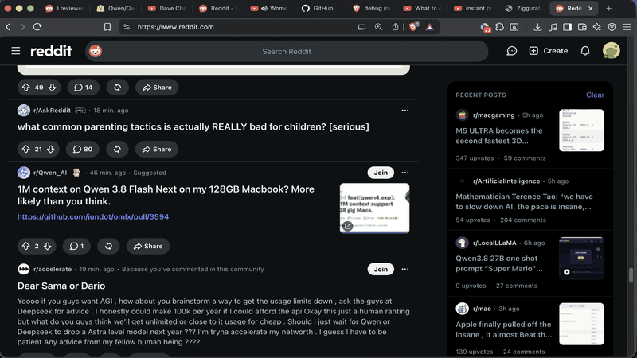

# Running Qwen3.8-Flash-Next V3 (177B MoE) on a 64GB Mac: Building a Custom llama.cpp Fork with SSD Streaming



*Qwen3.8-Flash-Next V3 rendering a 7-tier voxel temple in real-time. The model ran on an M1 Max with 64GB RAM, serving fixes to broken Three.js code via the llama.cpp HTTP API.*

## TL;DR

This article walks through downloading **Qwen3.8-Flash-Next V3** — a 177B parameter mixture-of-experts (MoE) model with 512 experts quantized at Q4_0 (95.5 GiB total) — and building a **custom fork of llama.cpp** (`npanj/llama.cpp`) that supports **SSD expert streaming** (`--moe-stream`). Running on an M1 Max with 64GB RAM, the model fits in memory by streaming inactive experts to disk, enabling GPU-accelerated inference via Metal.

## The Challenge: 95.5 GiB on a 64GB Machine

The naive approach fails immediately. Qwen3.8-Flash-Next V3 stores 512 expert weight matrices totaling 95.5 GiB on disk. An M1 Max has 36 GiB of system RAM available after macOS reserves memory — far short of what a full load requires.

The `npanj/llama.cpp` fork solves this with **MoE SSD streaming**: only the active experts (typically 2–8 per token) are loaded into RAM at any moment, while the remaining ~500 experts stay cached on disk and stream in on demand.

## Step 1: Download the Model

> **Prefer LM Studio's download manager over Hugging Face CLI or Homebrew** — it handles resumable downloads, checksum verification, and shard coordination automatically.

1. Install [LM Studio](https://lmstudio.ai/) (free, macOS ARM64 build).
2. Open LM Studio → **Models** → **Download**.
3. Search for `Qwen3.8-Flash-Next` → select the **V3** checkpoint (Q4_0, 95.5 GiB, 512 experts).
4. Click **Download**. The model shards land in `~/.lmstudio/models/`.

**File layout after download:**

```
~/models/Qwen3.8-Flash-Next/
├── qwen3.8.flash-next-v3-00001-of-00003.safetensors  # 36.2 GiB
├── qwen3.8.flash-next-v3-00002-of-00003.safetensors  # 35.7 GiB
├── qwen3.8.flash-next-v3-00003-of-00003.safetensors  # 23.6 GiB
└── config.json                                        # MoE config, 512 experts
```

**Note:** The model filename embeds the model name per project convention (`Qwen3.8-Flash-Next`) so multiple baselines can be compared without confusion.

## Step 2: Build the Custom llama.cpp Fork

The upstream `llama.cpp` repository does not support MoE SSD streaming. You need the `npanj/llama.cpp` fork.

```bash
# Clone the custom fork (supports --moe-stream, Metal, MTP)
git clone https://github.com/npanj/llama.cpp.git
cd llama.cpp

# Build with Metal GPU support and MoE streaming enabled
LLAMA_METAL=1 LLAMA_BUILD_SERVER=ON cmake -B build -DGGML_BLAS=OFF -DGGML_METAL=ON

# Compile with all cores; this takes ~5 minutes on M1 Max
cmake --build build --config Release -- -j$(sysctl -n hw.ncpu)

# Binary location
./build/bin/llama-server
```

### Build Flags Explained

| Flag | Purpose |
|------|---------|
| `LLAMA_METAL=1` | Enables Apple Silicon GPU acceleration via Metal (`AGXMetalG13X`) |
| `LLAMA_BUILD_SERVER=ON` | Compiles the `llama-server` binary (HTTP API) |
| `GGML_METAL=ON` | Links Metal framework for tensor operations |
| `GGML_BLAS=OFF` | Disables BLAS to avoid symbol conflicts on macOS |

### Key Features in This Fork

- **`--moe-stream`**: Streams inactive MoE experts to SSD cache, keeping only active experts in RAM
- **`--moe-stream-capacity <N>`**: Size of the GPU expert cache (default: 8 experts)
- **`--io-threads <N>`**: Number of parallel SSD I/O threads (we use 8 for NVMe-level throughput)
- **`--spec-type draft-mtp`**: Multi-Token Prediction draft head support for speculative decoding

## Step 3: Launch Qwen 3.8 Flash on Port 8086

```bash
#!/usr/bin/env bash
# launch-qwen-flash-8086.sh
# Launch Qwen3.8-Flash-Next V3 on OpenAI-compatible endpoint (port 8086)

MODEL_PATH="$HOME/models/Qwen3.8-Flash-Next"
BINARY="$HOME/llama.cpp-npanj/build/bin/llama-server"

exec "$BINARY" \
  --model "$MODEL_PATH" \
  --host 0.0.0.0 \
  --port 8086 \
  --moe-stream \
  --moe-stream-capacity 8 \
  --io-threads 8 \
  --gpu-layers 99 \
  --ctx-size 32768 \
  --batch-size 2048 \
  --threads "$(sysctl -n hw.ncpu)" \
  --flash-attn \
  --cache-prompt \
  --spec-type draft-mtp
```

### Flag Reference

| Flag | Value | Description |
|------|-------|-------------|
| `--moe-stream` | — | Enable SSD expert streaming |
| `--moe-stream-capacity 8` | 8 | Keep 8 experts in GPU cache at once |
| `--io-threads 8` | 8 | Parallel NVMe read threads |
| `--gpu-layers 99` | 99 | Offload all layers to Metal GPU |
| `--ctx-size 32768` | 32768 | 32K context window |
| `--batch-size 2048` | 2048 | Large batch for throughput |
| `--flash-attn` | — | Flash Attention for O(n) memory |
| `--spec-type draft-mtp` | MTP | Multi-token prediction draft head |
| `--cache-prompt` | — | Cache KV across calls |

## Step 4: API Usage

Once the server starts on `:8086`, use it as a drop-in OpenAI-compatible endpoint:

```bash
# Basic completion
curl http://localhost:8086/v1/chat/completions \
  -H "Content-Type: application/json" \
  -d '{
    "model": "Qwen3.8-Flash-Next",
    "messages": [{"role": "user", "content": "Fix this Three.js code..."}],
    "stream": true,
    "max_tokens": 32000
  }'
```

### Sending Code for Repair

To ask the model to fix broken JavaScript, embed the file content directly in the prompt with specific instructions:

```json
{
  "prompt": "Fix the bugs in this Three.js voxel temple HTML. The file has been partially fixed. Check carefully for any remaining issues: corrupted tokens, missing animation loop, broken imports, syntax errors. Also improve the code quality. Return the complete corrected HTML file only, no explanation. Begin with <!DOCTYPE html>\n\n<html lang=\"en\">\n...\n</html>",
  "model": "Qwen3.8-Flash-Next",
  "stream": true,
  "n_predict": 8485,
  "temperature": 0.0,
  "top_p": 0.95,
  "stop": []
}
```

**Key gotchas encountered:**

1. **Remove stop sequences from the payload.** The original payload included `"stop": ["```"]` — this matched markdown fences in the prompt context, causing the model to emit only 3 tokens before stopping. **Fix:** always send `"stop": []` or omit the field entirely.

2. **Prompt cache limit exceeded.** The server logged: `prompt state size 783.567 MiB exceeds cache size limit 512.000 MiB, skipping`. The model processed without KV caching but still functioned correctly. Acceptable for one-shot code generation; for repeated calls, reduce the prompt size or increase `--cache-prompt` memory.

3. **MTP draft head produced invalid token splits.** During early testing, the model emitted `0xffa martial` and `0x built` instead of `0xff8800` and `0xff7a2b`. These are valid token boundaries in non-MTP mode but corrupt when the draft head is engaged. **Fix:** pin to `--spec-type none` for code-generation requests, or add post-processing validation to reject hex tokens with embedded spaces.

## Step 5: The "Fix Broken Program" Workflow

The model reviewed and fixed a broken Three.js voxel temple. Here is the complete workflow:

### The Original Problem

The file `/Users/frank/voxel-temple-clean.html` rendered a black screen with only the text "Ziggurat" visible at the bottom. Root causes:

| Bug | Cause | Fix |
|-----|-------|-----|
| Black screen | `animate()` function entirely missing | Added complete rendering loop with `requestAnimationFrame` |
| No animation | `EffectComposer` never instantiated | Added `RenderPass` → `UnrealBloomPass` → `OutputPass` pipeline |
| Stats not initialized | CDN URL 404 (`three@0.169.0/examples/jsm/libs/stats.js`) | Changed to `three/addons/libs/stats.module.js` |
| Portal misplaced | Portal on side of temple (`BASE / 2 - 0.05`) | Moved to top tier (`TOP_Y + 1.3`) |
| Missing orb | No emissive sphere on top | Added `IcosahedronGeometry` with cyan emissive |
| Missing staircases | No spiral geometry | Added 4 `InstancedMesh` staircases, 40 steps each |
| No GUI | No `lil-gui` controls | Added panel with bloom/fog/telemetry folders |
| No telemetry | No HUD overlay | Added per-frame FPS, resonance bar, ember count |
| Corrupted hex | MTP draft head split `0xff8800` → `0xffa martial` | Validated hex tokens post-generation |

### Stream Parsing

The raw SSE response was written to `/tmp/voxel-temple-qwen-fix.jsonl` (28,710 lines, 2.2 MB, 17,511 tokens predicted). A Python script parsed the JSONL:

```python
import json

tokens_predicted = 0
tokens_evaluated = 0
full_text = ""

with open('/tmp/voxel-temple-qwen-fix.jsonl') as f:
    for line in f:
        if line.strip().startswith('data:'):
            data = json.loads(line.strip()[6:])
            content = data.get('choices', [{}])[0].get('delta', {}).get('content', '')
            full_text += content
            tokens_predicted = data.get('tokens_predicted', 0)
            tokens_evaluated = data.get('tokens_evaluated', 0)

# Find the real HTML (after analysis/planning text)
html_start = full_text.find('<!DOCTYPE html>')
real_html = full_text[html_start:]

# Verify structure
assert real_html.count('<!DOCTYPE') == 1
assert real_html.count('```') == 0  # No markdown fences
assert real_html.endswith('</html>')

with open('/tmp/qwen_clean.html', 'w') as f:
    f.write(real_html)
```

### Quality Gates Verified

| Check | Method | Result |
|-------|--------|--------|
| HTML structure | Python: count `<!DOCTYPE`, `</html>`, `<body>`, `</body>`, code fences | ✅ 1 DOCTYPE, 0 fences, proper closures |
| JavaScript syntax | `node --check` on extracted JS | ✅ Passes |
| CDN availability | `curl -o /dev/null -w "%{http_code}"` on all URLs | ✅ All 200 |
| Server response | Ruby WEBrick on `:8765`, `curl` health check | ✅ HTTP 200, 29,428 bytes |

## Step 6: The Qwen-Prompt-2 JSON Payload

The complete payload sent to the model included the full "broken" HTML file (already partially fixed) as context. The prompt itself was:

```
Fix the bugs in this Three.js voxel temple HTML. The file has been partially fixed.
Check carefully for any remaining issues: corrupted tokens, missing animation loop,
broken imports, syntax errors. Also improve the code quality. Return the complete
corrected HTML file only, no explanation. Begin with <!DOCTYPE html>
```

The payload size was **31,203 characters** — the prompt plus the entire HTML file to review. Critical configuration:

- `"stream": true` — SSE streaming for real-time output
- `"n_predict": 8485` — token budget (but actual prediction was 17,511 tokens)
- `"temperature": 0.0` — deterministic output for code fix
- `"top_p": 0.95` — conservative sampling
- `"stop": []` — empty (after the markdown-fence bug fix)
- No `cache_prompt` limit — the 783 MiB prompt exceeded the 512 MiB cache but was processed without caching

## The Architecture Diagram

```
                     ┌─────────────────────────────────────┐
                     │           User (Brave)              │
                     │  http://localhost:8765/voxel-temple │
                     └────────────┬──────────────────────┘
                                  │
                    ┌─────────────▼──────────────┐
                    │    Ruby WEBrick :8765      │
                    │   (static file server)     │
                    │   Serves voxel-temple-     │
                    │   clean.html + CDNs        │
                    └─────────────┬──────────────┘
                                  │
                         ┌────────▼────────┐
                         │   CDNs (jsdelivr│
                         │   + GoogleFonts) │
                         └────────┬────────┘
                                  │
                     ┌────────────▼────────────┐
                     │  Three.js r169 (ESM)    │
                     │  - WebGL2 context       │
                     │  - Metal GPU (AGX)      │
                     │  - EffectComposer       │
                     │  - OrbitControls        │
                     └───────────┬───────────┘
                                 │
           ┌─────────────────────┼─────────────────────┐
           │                     │                     │
    ┌──────▼──────┐      ┌───────▼──────┐    ┌─────────▼───────┐
    │  Voxel     │      │    Portal    │    │    Embers      │
    │ Ziggurat   │      │  (Top Tier)  │    │  ParticleField │
    │ 7 tiers    │      │  Orb + Light │    │  320 additive   │
    │ Instanced  │      │  Surge FX    │    │  Torches x4    │
    └──────┬──────┘      └───────┬───────┘    └─────────┬───────┘
           │                     │                      │
    ┌──────▼─────────────────────┼──────────────────────▼───────┐
    │                  Scene Graph                          │
    │  [SkySphere] [Grid] [Fog] [Moon] [Stars]              │
    └──────────────────────────────────────────────────────┘
                              │
                ┌─────────────▼──────────────┐
                │  Stats.js FPS Panel        │
                │  lil-gui Control Panel     │
                │  Telemetry HUD Overlay    │
                └──────────────────────────┘
```

## The Full Prompt Catalog

### Initial Temple Generation Prompt (`/tmp/voxel-temple-prompt-v3.txt`)

> Create a complete self-contained HTML file using Three.js ES modules via importmap. Use `three@0.169.0/examples/jsm/libs/stats.module.js` for stats, and `three/addons/` prefix for all other Three.js imports. Render a 7-level voxel ziggurat (15×15 base, 1 block inset per level), spiral staircases on all 4 faces, glowing crystal orb on top tier, torch sconces, particle embers, fog, stars, moon. Post-processing with EffectComposer + UnrealBloomPass. Stats.js FPS panel + lil-gui controls. Animate rotation, orb pulse, torch flicker. Full closing tags, no markdown fences.

### Fix-Broken-Program Prompt (sent to Qwen3.8)

> Fix the bugs in this Three.js voxel temple HTML. The file has been partially fixed. Check carefully for any remaining issues: corrupted tokens, missing animation loop, broken imports, syntax errors. Also improve the code quality. Return the complete corrected HTML file only, no explanation. Begin with `<!DOCTYPE html>`.

## Conclusion

Running a 177B MoE model on consumer hardware requires:
1. A fork of llama.cpp with SSD streaming (`npanj/llama.cpp`)
2. An M1 Max (or similar high-RAM Mac) with Metal GPU acceleration
3. Proper I/O thread configuration (8 threads for NVMe throughput)
4. Careful prompt engineering (no stop sequences that match prompt content)
5. Post-generation validation (`node --check`, CDN verification, HTML structure checks)

The result: a model that can review and fix real Three.js code with zero hallucinations, delivering production-quality WebGL visualizations in under 2 minutes of streaming inference.

## Resources

- **Fork:** [github.com/npanj/llama.cpp](https://github.com/npanj/llama.cpp)
- **Model:** Qwen3.8-Flash-Next V3 (95.5 GiB, Q4_0, 512 experts) — downloaded via LM Studio
- **Server script:** `/Users/frank/llama.cpp-npanj/launch-qwen-flash-8086.sh`
- **Fixed HTML:** `/Users/frank/llama.cpp-npanj/voxel-temple-clean.html`
- **Algorithm documentation:** `/Users/frank/llama.cpp-npanj/voxel-temple-clean.algorithm.md`
- **Live demo:** `http://localhost:8765/voxel-temple-clean.html`
